<div align="center">
  <h1 align="center">
    LuCI design theme for OpenWrt
  </h1>
<a href="/LICENSE">
    
  </a>
  <a href="https://github.com/gngpp/luci-theme-design/pulls">
    
  </a><a href="https://github.com/gngpp/luci-theme-design/issues/new">
    
  </a><a href="https://github.com/gngpp/luci-theme-design/releases">
    
  </a><a href="hhttps://github.com/gngpp/luci-theme-design/releases">
    
  </a>
</div>
<br>

# luci-theme-design

 luci-theme-design 是一个针对移动端和PC端的沉浸式WebApp体验和优化的OpenWrt LuCI主题
- **luci-theme-design**基于luci-theme-neobird二次开发, 适用于[lede](https://github.com/coolsnowwolf/lede)
- main支持lede源码的lua版本
- js分支开始由[papagaye744](https://github.com/papagaye744)维护

- 你可以使用[插件](https://github.com/gngpp/luci-app-design-config)定义一些设置
  - 支持更改主题深色/浅色模式
  - 支持显示/隐藏导航栏
  - 支持更换常用的代理图标

### 主要特点

- 适配移动端响应式优化，适合手机端做为WebApp使用
- 修改和优化了很多插件显示，完善的设备icon图标，视觉统一
- 简洁的登录界面，底部导航栏，类App的沉浸式体验
- 适配深色模式，适配系统自动切换，插件式自定义模式
- 支持插件式配置主题
- 流畅度比肩bootstrap

### 体验WebApp方法

- 在移动端(iOS/iPadOS、Android谷歌)浏览器打开设置管理，添加到主屏幕即可。

### 编译

```
git clone https://github.com/gngpp/luci-theme-design.git  package/luci-theme-design
make menuconfig # choose LUCI->Theme->Luci-theme-design  
make V=s
```

### Q&A

- 有bug欢迎提issue
- 主题个人配色可能会不符合大众胃口，欢迎提配色建议

### 预览

<details> <summary>iOS</summary>
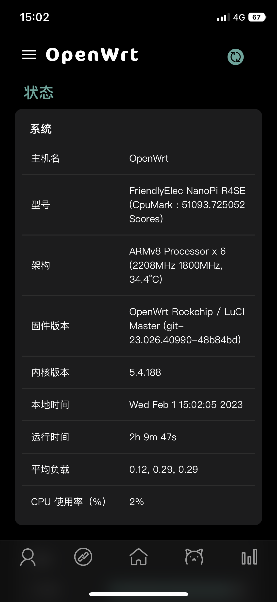
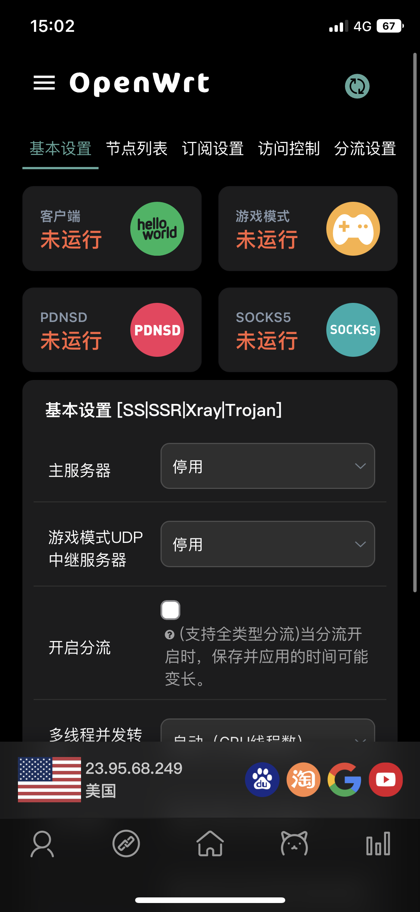
</details>

<details> <summary>iPadOS</summary>
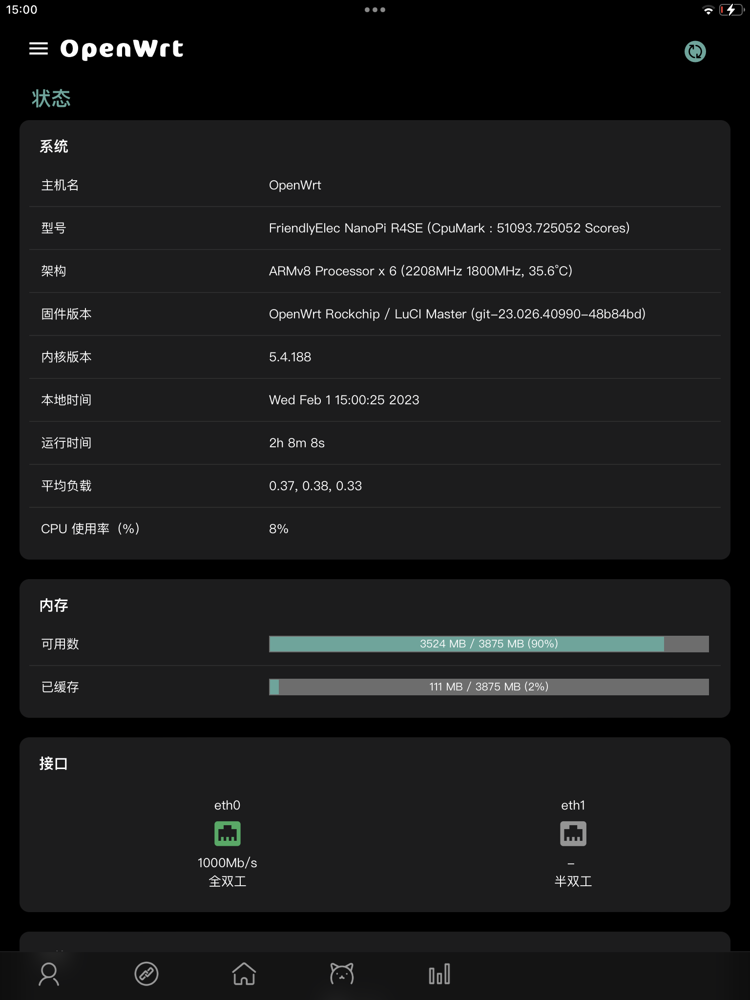
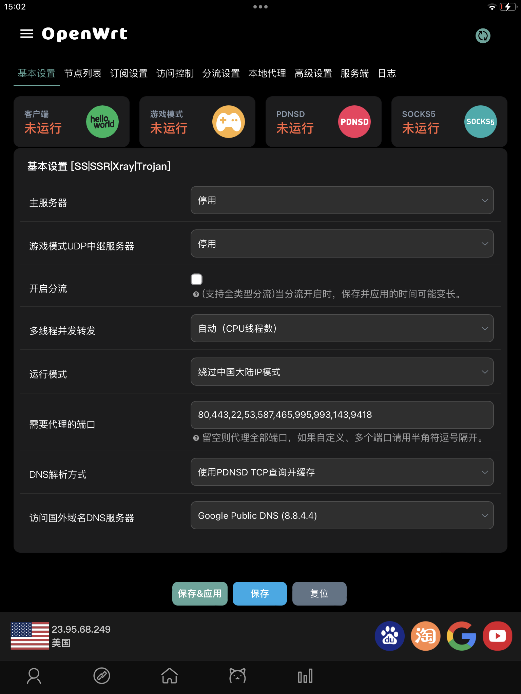
</details>

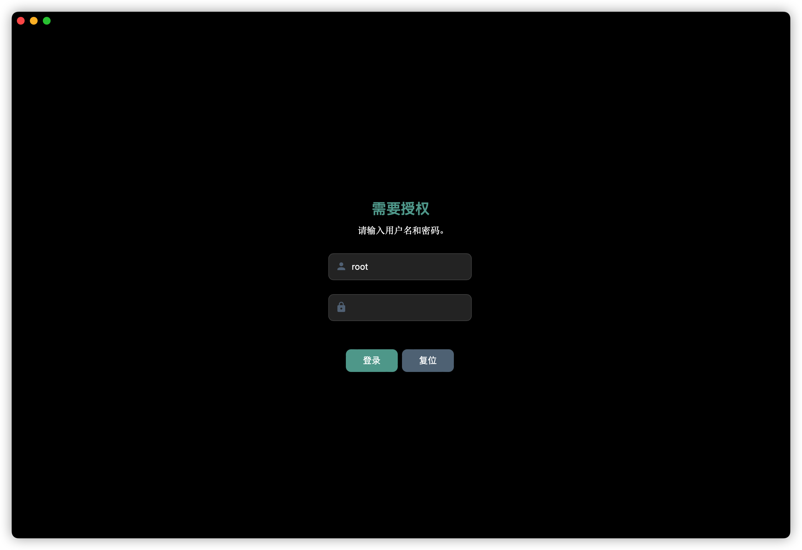
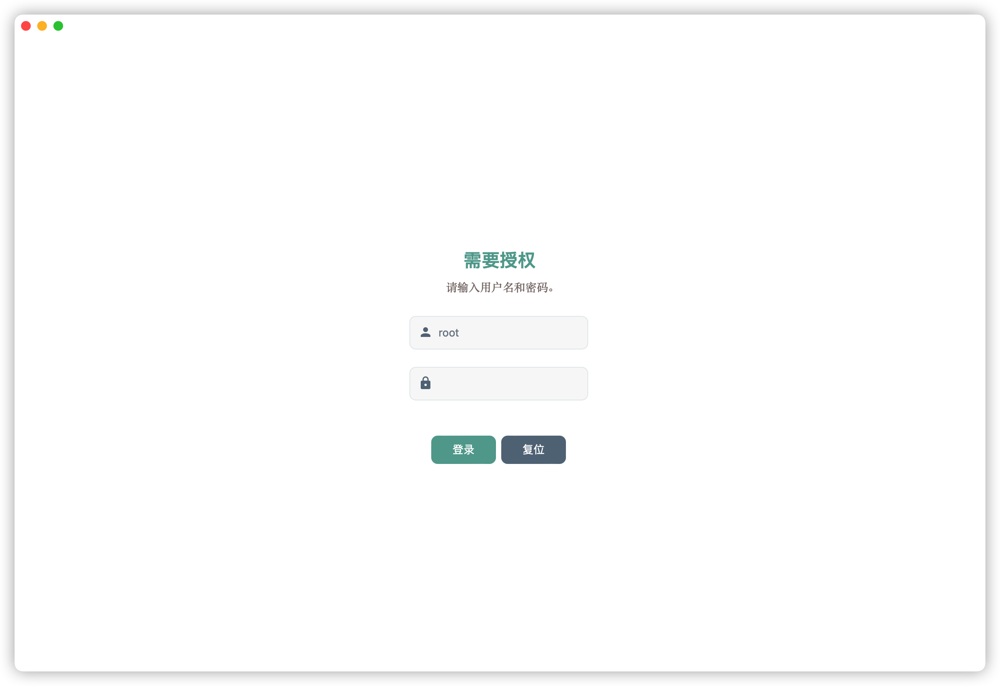
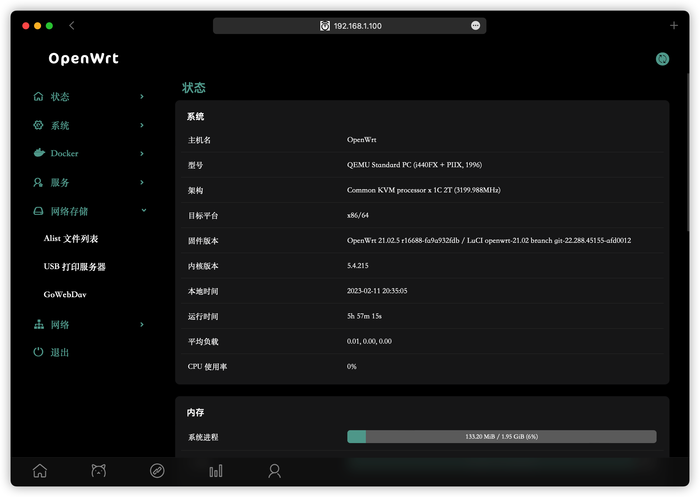
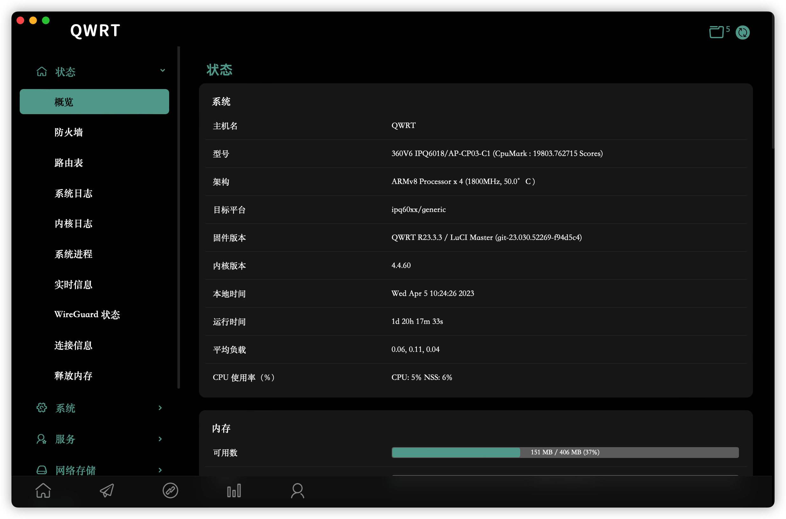
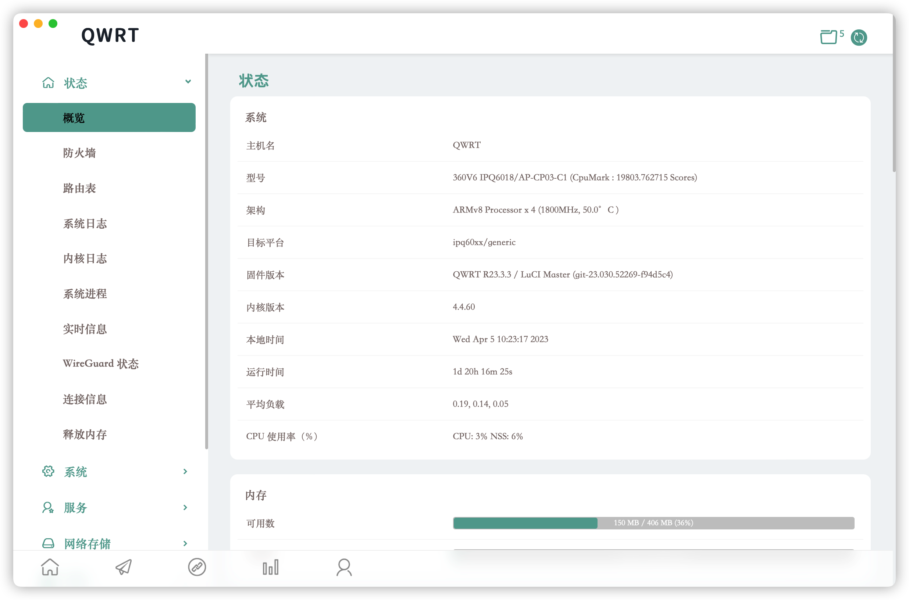
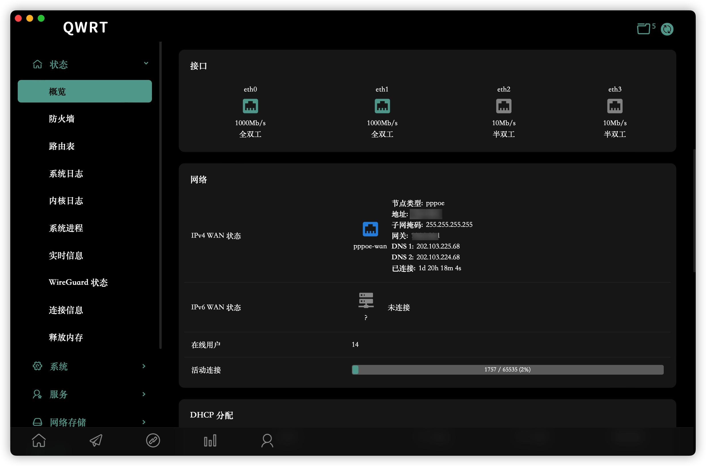
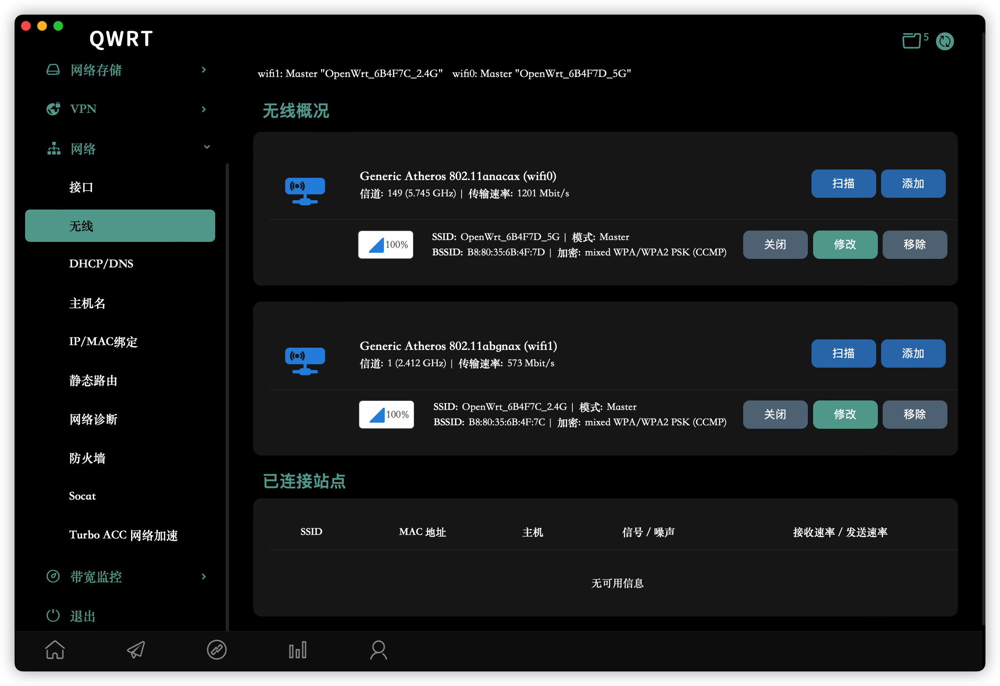
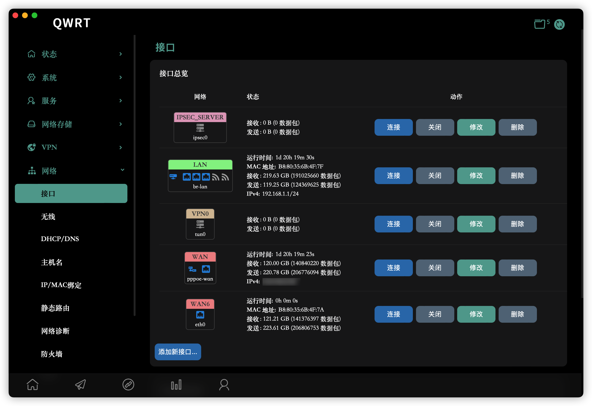
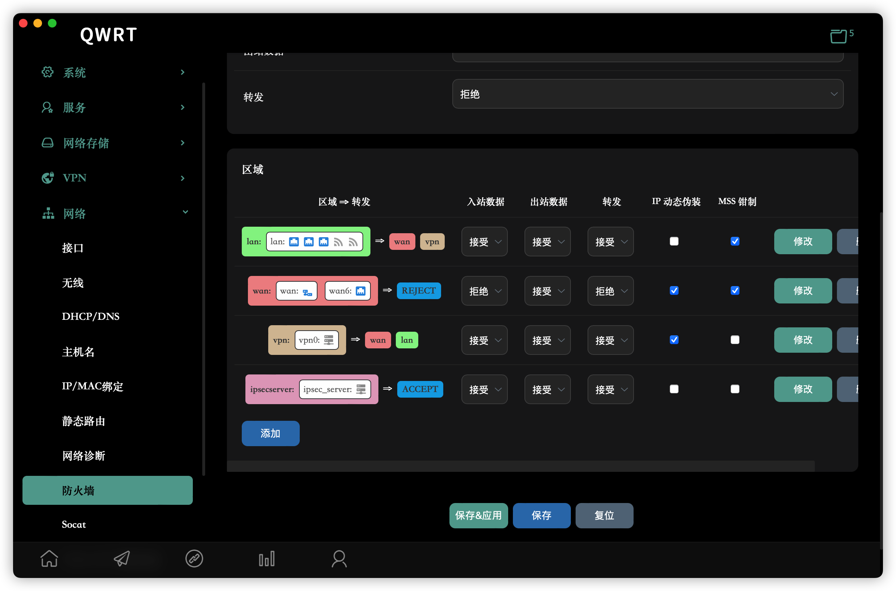
