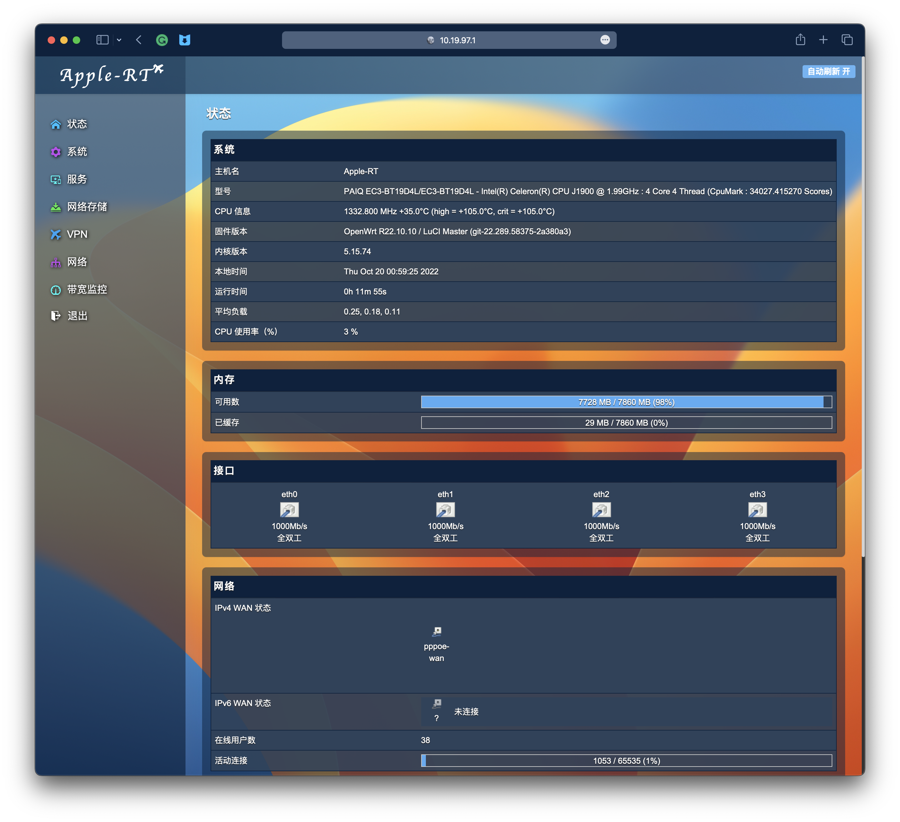

# luci-theme-fruitbingo

[1]: https://img.shields.io/badge/license-Apache2-brightgreen.svg

[2]: ./LICENSE

[3]: https://img.shields.io/badge/PRs-welcome-brightgreen.svg

[4]: https://github.com/realJustinLee/luci-theme-fruitbingo/pulls

[5]: https://img.shields.io/badge/Issues-welcome-brightgreen.svg

[6]: https://github.com/realJustinLee/luci-theme-fruitbingo/issues/new

[7]: https://img.shields.io/badge/release-v1.5-orange.svg?

[8]: https://github.com/realJustinLee/luci-theme-fruitbingo/releases

[9]: https://img.shields.io/github/downloads/realJustinLee/luci-theme-fruitbingo/total

[10]: https://img.shields.io/badge/Contact-Null-blue

[11]: Null
[![license][1]][2]
[![PRs Welcome][3]][4]
[![Issue Welcome][5]][6]
[![Release Version][7]][8]
[![Release Count][9]][8]
[![Contact Me][10]][11]

FruitBingo is a clean HTML5 theme for LuCI. It is based on luci-theme-material.

Copyright 2022 Justin Lee <JustinDellAdam@live.com>

This theme is specially designed for [Lean's OpenWrt](https://github.com/coolsnowwolf/lede), and can also be used for
other versions of OpenWrt. It is currently compatible with Luci18, and other versions of Luci are planned to be
developed after this version is stable.

### Adding FruitBingo to your own LEDE/OpenWRT Build

Edit your feeds.conf.default and add the following to it:

```
# luci-theme-infinityfreedom
src-git fruitbingo https://github.com/realJustinLee/luci-theme-fruitbingo.git
```

Update your build environment and install the package:

```shell
./scripts/feeds update -a && ./scripts/feeds install -a
make menuconfig -j
```

Go to LuCI -> Themes, select luci-theme-fruitbingo, exit, save and build as usual.

Enable the Theme
----------------

* Go to System -> System -> Language and Style
* Choose 'fruitbingo' in the Design checkbox

ScreenShots
----------------


